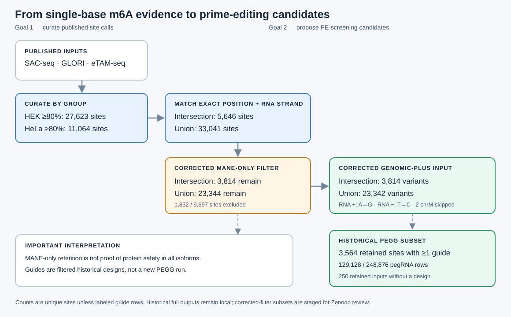

# Single-base m6A curation and computational pegRNA candidates

This repository documents a Python workflow for curating published single-base m6A measurements in HEK- and HeLa-labelled samples and proposing pegRNA candidates for a future prime-editing screen. Public v0.3.1 contains analysis scripts, tests, figures, aggregate QC summaries and provenance metadata. Corrected site-level tables and full guide lists remain unpublished and are not included here.

These are computational candidates, not experimentally validated screening reagents. The negative-strand coding-effect error has been corrected, but PEGG was not rerun. The ≥80% methylation cutoff is exploratory: we hypothesize that editing highly methylated sites might yield clearer phenotypes, but this has not been tested. PE was chosen to target specified DNA substitutions while potentially reducing, not eliminating, bystander edits relative to some alternative editors. A DNA edit could affect RNA independently of m6A.

Analysis scripts, QC audits and documentation were developed with AI-assisted coding tools under Yuling Zhou's direction and review.



The diagram uses **sites**, **site–transcript effect rows**, and **pegRNA rows** as different units. The dashed link means that corrected candidates are a *subset of historical PEGG designs*, not guides newly regenerated by PEGG. The new [distribution figure](figures/m6a_distribution_corrected.svg) and its [bin counts](figures/m6a_distribution_counts.csv) are rebuilt from locally reviewed union tables; older Prism/JPEG plots are historical and should not be used for current counts.

## What is here

| Stage | Intersection | Union | Interpretation |
| --- | ---: | ---: | --- |
| HEK and HeLa group, mean m6A ≥80% | HEK 27,623; HeLa 11,064 | same inputs | Exploratory high-methylation sets |
| Match exact chromosome, 1-based position and RNA strand | 5,646 | 33,041 | Present in both groups / either group |
| Corrected MANE-only nonsynonymous A→G exclusion | 3,814 | 23,344 | Retained candidates, **not** proven protein-neutral |
| Corrected genomic-plus PEGG input | 3,814 | 23,342 | Two union mitochondrial sites unsupported by the converter |
| Retained sites with ≥1 historical guide | 3,564 | Not designed here | Both historical intersection runs cover the same 3,564 retained sites |
| Historical guides restricted to corrected sites | 129,128 default-like; 248,876 custom | Not available | Design rows, not unique sites |

For comparison, the **historical, uncorrected** filter retained 4,075 intersection and 24,548 union sites. A reverse-strand codon-orientation error caused negative-strand CDS effects to be missed or misclassified. The original files remain in `data/intermediate/`; independently named corrections are in `data/reanalysis/`. The historical `potential_SNP.xlsx` is not evidence that these sites are SNPs: its rows largely reflect that orientation error. Target-cell genotypes have not been checked.

### Repository map

| Location | Contents and planned availability |
| --- | --- |
| `data/processed/` | Local HEK/HeLa union and ≥80% site tables; **not in the new public release** pending source-value rights review |
| `data/intermediate/` | Local **historical** region, CDS, effect, filter and input CSVs; not a corrected public dataset |
| `data/reanalysis/` and `data/summary/` | Local corrected site-level audit and guide extracts; no bulk site tables in the new public release |
| [`scripts/`](scripts/) and [`tests/`](tests/) | Public analysis/export code, source verification and strand tests; [current coding-effect script](scripts/predict_AtoG_coding_effects.py) and [superseded versions](scripts/legacy/README.md) are explicitly separated |
| [`figures/`](figures/) | Public workflow diagram and corrected reproducible distribution plot; historical JPEGs stay local |
| [`metadata/`](metadata/) | Public source/reference provenance, data dictionary, QC and workflow notes |
| Optional future data deposit | Local lean guide-only CSVs exist for review; **no Zenodo deposit is planned for this application** |

The full historical PEGG CSVs and their corrected-filter subsets are kept **locally**, outside Git because they exceed ordinary GitHub file limits. Lean, provenance-labelled guide extracts also remain local; **this repository is not a public row-level dataset and has no data DOI**. A future deposit would require a separate file-level review of source-derived coordinates and values. A rank-1 extract is a model-ranked review convenience, not a pass/fail guide-selection threshold.

## Biological and computational choices

SAC-seq contributes a worksheet labelled **HEK293** and a HeLa worksheet; GLORI contributes **HEK293T**; eTAM-seq contributes HeLa. “HEK group” is an analysis grouping, not a claim that HEK293 and HEK293T are identical samples. The [source matrix](metadata/SOURCES.md) gives paper citations and exact source-to-column assignments. The group `m6a_mean` is the arithmetic mean of available method values; no minimum number of supporting methods or variance cutoff was imposed. Of the ≥80% sites, 26,162/27,623 HEK and 10,840/11,064 HeLa sites have a value from only one method. Accordingly, ≥80% is **not** evidence of cross-method agreement.

The coding policy is **MANE Select only**: remove a site when a corrected RNA A→G call is nonsynonymous in a matching MANE transcript. Among retained CDS sites, 40 intersection and 262 union sites have no matching MANE effect row; 33 and 215 retained sites respectively have nonsynonymous effects on other annotated transcripts. “Does not change codon” is inaccurate: the nucleotide triplet changes, even when the encoded amino acid does not. The site-fate tables are local pending rights review; summary counts are in the [QC report](metadata/corrected_qc_report.json).

The recorded custom PEGG call sets RTT lengths `20,22,25,27,30,32,35`, minimum RHA `6`, and `sensor=False`; it does **not** impose a maximum RHA of 10. Other omitted settings follow the locally inspected PEGG 2.1.0 signature, but the exact version/arguments of the older outputs are not fully proven. No additional efficiency, off-target, oligo-feasibility or experimental filters were applied. Under the corrected filter, 250 intersection inputs have no historical guide. Their parameter-specific reasons are in the local `data/reanalysis/historical_pegg_coverage_audit.csv`; every predicted yes/no design outcome matched the historical outputs. The [parameter audit](metadata/DESIGN_PARAMETERS.md) explains the distinction between recorded settings, defaults and inference.

## Reproduce and review

Use Python 3.9 with the packages in [`environment.yml`](environment.yml); activate that environment before running the commands below. For example, `conda env create -f environment.yml` followed by `conda activate m6a-pegg` creates and selects the declared environment; this exact fresh-environment install has **not** been verified. The 13 unit tests pass in the existing Python 3.9 `pegg_env` and in a clean export of the tracked v0.2.0 files. Running them under the system Python 3.13 without dependencies fails at import. PEGG itself currently has a NumPy/cyvcf2 import conflict in the local environment. **This snapshot does not rerun PEGG**; exact historical run provenance and sequence-level reproducibility remain unverified. Download the cited source workbooks/TXT and exact GRCh38/MANE references listed in [source provenance](metadata/SOURCES.md) and [reference provenance](metadata/REFERENCE_FILES.md), retaining their names at the repository root for the existing commands. They are intentionally not included in this release tree.

```bash
python -m unittest discover -s tests -v
python scripts/verify_sac_glori_sources.py
python scripts/verify_etam_source.py
python scripts/rebuild_source_unions.py
python scripts/verify_reference_alleles.py --input-dir data/reanalysis --suffix .corrected --all-union-sites
python scripts/plot_m6a_distribution.py
python scripts/audit_pegg_coverage.py
python scripts/build_corrected_release.py
```

The last two commands require the local historical full PEGG CSVs. To create locally ignored full corrected-filter subsets, add `--full-guides` to `build_corrected_release.py`; then run `python scripts/export_zenodo_candidates.py` only if preparing a future, separately reviewed data deposit. The full source-to-guide workflow needs separately downloaded source/reference files and historical PEGG outputs; the public clone alone does **not** regenerate the old PEGG designs. The [workflow](metadata/WORKFLOW.md) and [QC checklist](metadata/RELEASE_QC.md) state the exact boundary.

## Limits and future work

The unpublished curated dataset contains computational candidates, **not** a functionally screened m6A atlas or assay-ready library. The exploratory cutoff, uneven source support, sample/protocol differences and MANE-only transcript rule need stronger statistical and isoform-aware follow-up. A future screen must confirm target-cell genotype, editing efficiency, off-target/bystander effects, control design and phenotype attribution. Sites excluded because direct A→G changes an amino acid may still be addressable by a different intervention, such as a carefully assessed DRACH-motif edit. Even synonymous DNA edits can change splicing, RNA stability or expression independently of m6A. The work does not claim to replicate [FOCAS](https://doi.org/10.1016/j.cell.2025.11.037), which uses a different perturbation strategy.

## Citation, rights and release status

Cite the [SAC-seq](https://doi.org/10.1038/s41587-022-01243-z), [GLORI](https://doi.org/10.1038/s41587-022-01487-9), [eTAM-seq](https://doi.org/10.1038/s41587-022-01587-6) and [MANE](https://doi.org/10.1038/s41586-022-04558-8) publications when using their contributions. [`CITATION.cff`](CITATION.cff) lists Yuling Zhou as creator. The [MIT license](LICENSE) covers original code; [CC BY 4.0](LICENSE-CC-BY-4.0.md) covers original documentation, figures and aggregate counts. Neither relicenses third-party source measurements, papers, workbooks, GEO files or genome references. The corrected row-level dataset is unpublished, and no Zenodo data DOI is planned for this application. Any future row-level data deposit requires a separate rights and file-level review.
