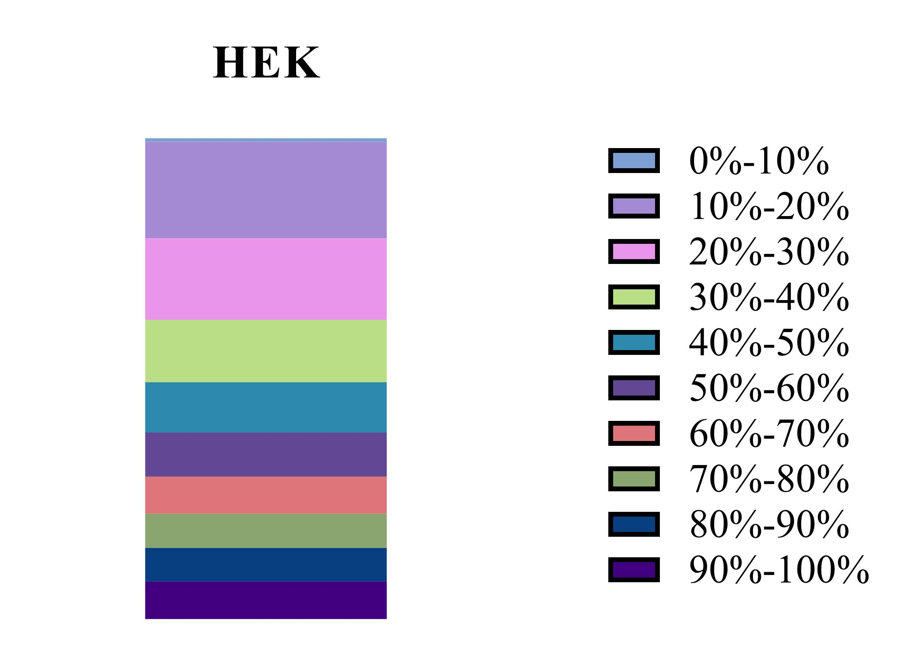
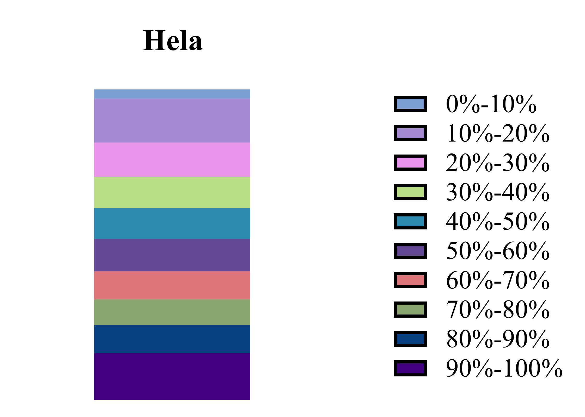

# Single-base m⁶A curation and computational pegRNA candidates

This repository documents a Python workflow (v0.3.1) that combines published single-base m⁶A measurements from SAC-seq, GLORI and eTAM-seq and nominates pegRNAs for a future prime-editing (PE) screen. It is a **computational research output**, not an experimentally validated guide library. Analysis scripts, QC audits and documentation were developed with AI-assisted coding tools under the author's direction and review. The public repository contains code, tests, figures and aggregate QC; source supplements, curated site-level tables and full pegRNA lists are not redistributed.

## Results at a glance

SAC-seq contributes HEK293 and HeLa measurements, GLORI contributes HEK293T, and eTAM-seq contributes HeLa. The **HEK group** is an analysis grouping of HEK293- and HEK293T-labelled sources, not a claim that they are identical samples. We calculated the mean methylation level over available measurements for each site and selected sites at **≥80%**. This threshold is an exploratory screening hypothesis, not a validated biological cutoff.

An *intersection* site has the same chromosome, 1-based coordinate and RNA strand in both the HEK and HeLa high-methylation sets; the *union* contains sites in either set.

| Distinct-site result | Intersection | Union |
| --- | ---: | ---: |
| ≥80% sites combined across groups | 5,646 | 33,041 |
| Retained after corrected MANE Select coding-effect filter | 3,814 | 23,344 |
| Converted to PEGG variant inputs | 3,814 | 23,342 |
| Retained sites with ≥1 previously designed pegRNA | 3,564 | Not designed |

The starting high-methylation sets contain **27,623 HEK-group** and **11,064 HeLa-group** sites. Two mitochondrial union sites could not be converted to PEGG inputs. The two earlier intersection PEGG runs produced guides for 3,564 of the 3,814 currently retained sites; 250 have no guide under those runs. The corrected subsets contain 129,128 and 248,876 pegRNA **rows**, respectively—multiple guides can target one site. PEGG was **not rerun** after the coding-effect correction, and no union-wide guide design was performed.

## Workflow


After defining the high-methylation sets, we annotated CDS/UTR regions with the hg38 RefSeq GTF, mapped CDS sites to same-strand transcripts, and modelled the amino-acid effect of RNA A→G using GRCh38 sequence. A site can map to several transcripts, so the effect table can have several rows per site. We excluded a site only if at least one modelled edit was nonsynonymous in a matching [MANE Select](https://www.ncbi.nlm.nih.gov/refseq/MANE/) v1.5 transcript. The filter first deduplicates qualifying site IDs and then removes them from the full intersection or union; it does **not** subtract transcript-row counts from site counts. The exact source/reference files and counts are in the [workflow notes](metadata/WORKFLOW.md), [source provenance](metadata/SOURCES.md) and [reference inventory](metadata/REFERENCE_FILES.md).

The original PEGG runs used the intersection input. For RNA-positive-strand sites, the equivalent reference-genome edit is A→G; for RNA-negative-strand sites, it is T→C. The recorded custom call used RTT lengths 20, 22, 25, 27, 30, 32 and 35, minimum RHA 6, and `sensor=False`. Other settings and the earlier run's provenance are assessed in the [parameter audit](metadata/DESIGN_PARAMETERS.md).

These researcher-authored Prism plots show the distributions behind the ≥80% selection; the [checked bin-count table](figures/m6a_distribution_counts.csv) gives the underlying totals (186,249 HEK-group and 45,944 HeLa-group sites).

<p> </p>

## Explore or reproduce

| Location | What it provides |
| --- | --- |
| [`scripts/`](scripts/) | Curation, annotation, coding-effect, MANE-filtering, PEGG-input and QC code |
| [`tests/`](tests/) | Small strand, threshold and export regression tests |
| [`figures/`](figures/) | Workflow diagram, Prism figures and audited distribution counts |
| [`metadata/`](metadata/) | Data dictionary, source/reference versions, detailed methods and QC |

To run the tests, use the Python 3.9 environment described in [`environment.yml`](environment.yml):

```bash
conda env create -f environment.yml
conda activate m6a-pegg
python -m unittest discover -s tests -v
```

The 13 tests pass in the existing local Python 3.9 environment; a fresh installation of the declared environment has **not** been verified. Full analysis also requires the cited source tables and GRCh38/MANE files, which are not in this repository. The [detailed workflow](metadata/WORKFLOW.md) lists the commands and expected inputs. The public clone alone cannot regenerate the earlier full PEGG outputs.

## Interpretation and limits

A previous negative-strand codon-orientation error made some mapped RNA A bases appear non-A and affected the MANE-based site filter. The **corrected** site counts above come from reanalysing coding effects; existing pegRNA designs were subset to the retained intersection sites, not generated again. The earlier `potential_SNP.xlsx` label is **not evidence of SNPs**; see the [record-level audit](metadata/POTENTIAL_SNP_AUDIT.md).

Most ≥80% sites have measurements from only one method; no minimum method support or variability cutoff was imposed. The MANE-only rule does not establish protein neutrality across all isoforms. PEGG uses PAM eligibility during design, but no additional efficiency, off-target or synthesis-feasibility cutoff was applied. Candidates have not been checked against the intended cells' genotype or experimentally tested for editing efficiency or phenotype. Although PE was selected to target specified DNA changes while potentially reducing bystander edits, a resulting phenotype could arise from DNA-sequence effects independent of m⁶A. These are candidates for follow-up, not assay-ready or functionally validated screening reagents. More QC boundaries are documented in the [release checklist](metadata/RELEASE_QC.md).

## Citation and availability

Please cite the contributing [SAC-seq](https://doi.org/10.1038/s41587-022-01243-z), [GLORI](https://doi.org/10.1038/s41587-022-01487-9), [eTAM-seq](https://doi.org/10.1038/s41587-022-01587-6) and [MANE](https://doi.org/10.1038/s41586-022-04558-8) publications. [`CITATION.cff`](CITATION.cff) names Yuling Zhou as this project's creator. Original code is under [MIT](LICENSE); original documentation, figures and aggregate counts are under [CC BY 4.0](LICENSE-CC-BY-4.0.md). These licenses do not cover third-party source files. Site-level tables and full pegRNA lists remain local pending a separate redistribution review; this repository has no dataset DOI.
